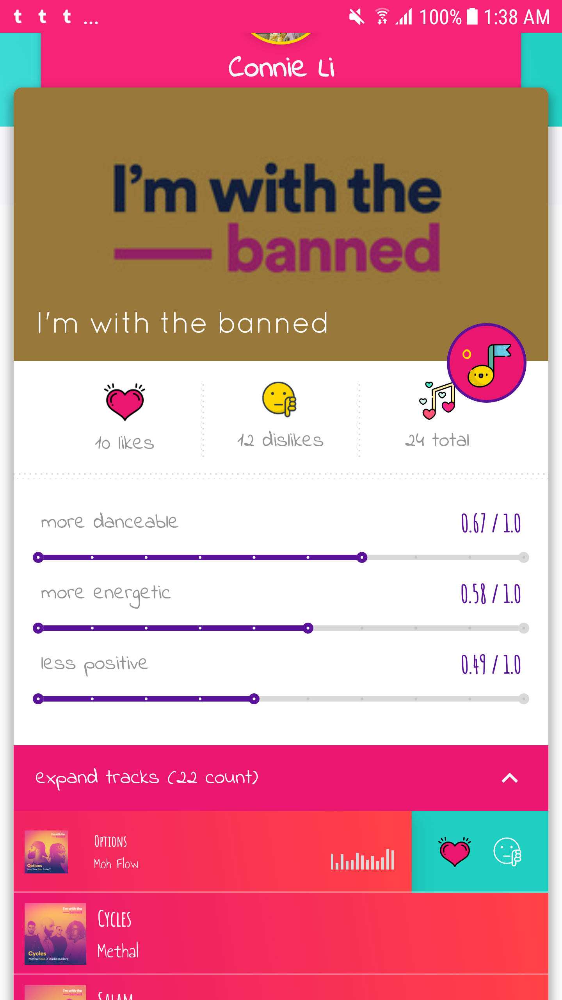
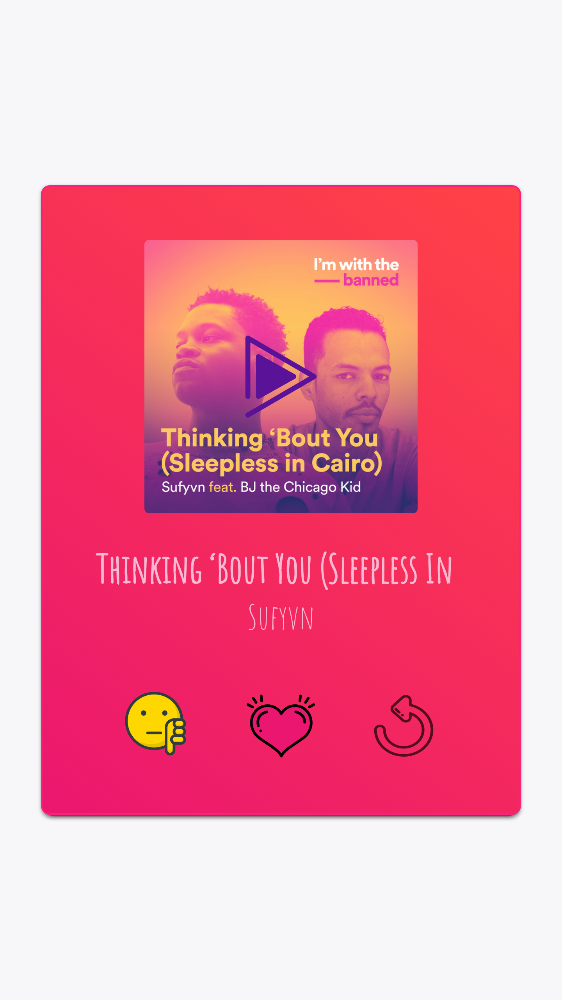
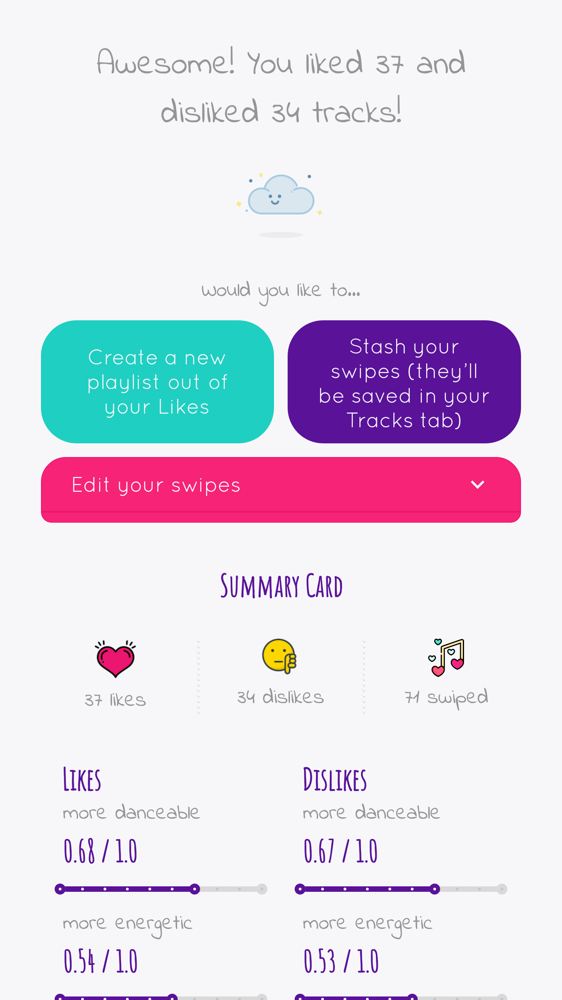
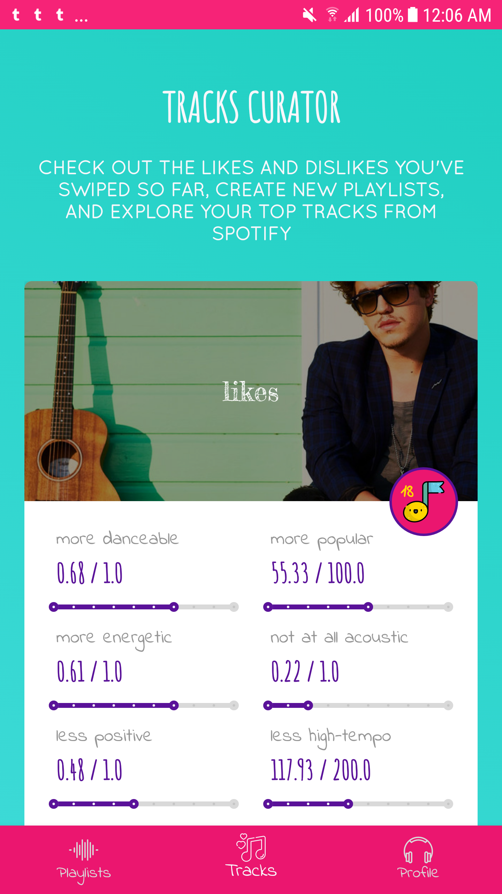
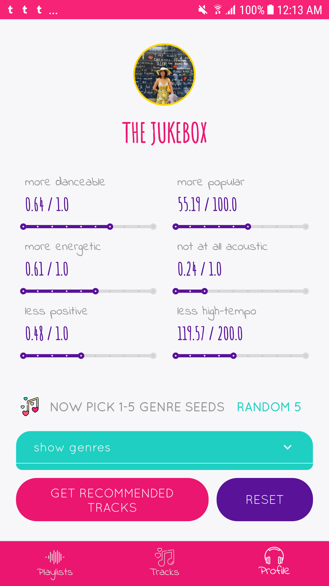

SONGBITS
---------------

A delightful playlist maker for Spotify - swipe playlists to like and dislike tracks, create playlists from your likes, check out tracks 
stats, and build your own recommendations playlists by hand-tuning stats and genres! 

Swipe, preview, and like/dislike tracks in place to make new playlists | Check out stats and create new playlists from all your likes and top tracks  | Create custom recommendations by hand-tuning stats and genres   
:------- | :------------| :--------
||  

One day I got frustrated with Discover Weekly and thought "why can't I just pluck out the one or two tracks I actually like??" and 
hence "tinder for spotify" was born. And then I added more screens so I wouldn't have to call it "tinder for spotify". 👍 

       
      

SUMMARY 
---------------

This project was really an excuse for me to bite off more than I can chew and EXPLORE ALL THE THINGS!1!!, so it is an unholy amalgamation
 of:
- [**A Model-View-Intent "reactive" architecture**](https://android.jlelse.eu/reactive-architecture-7baa4ec651c4), inspired by Redux's 
[uni-directional data flow](https://redux.js.org/basics/data-flow) and [viewstates as finite state machines](https://engineering.udacity.com/modeling-viewmodel-states-using-kotlins-sealed-classes-a5d415ed87a7) 
	- [sealed](app/src/main/java/com/cziyeli/songbits/home/HomeIntents.kt) [classes](app/src/main/java/com/cziyeli/domain/summary/SummaryAction.kt)... [sealed](app/src/main/java/com/cziyeli/domain/tracks/TrackResult.kt) [classes](app/src/main/java/com/cziyeli/songbits/cards/CardsIntents.kt) [everywhere](app/src/main/java/com/cziyeli/domain/playlistcard/PlaylistCardActions.kt)
- Android Arch Components and [Room](data/src/main/java/com/cziyeli/data/local/TracksDao.kt)
- [Repository pattern](data/src/main/java/com/cziyeli/data/Repository.kt)
- RxJava/RxKotlin voodoo
- Lots of UI tidbits like shared element transitions and lottie animations
- Kotlin, in varying states of quality

### [TODO: Insert Medium post actually talking about all this stuff]!!

What do we mean by MVI? There's a great outline in [the unofficial boiler](https://github.com/oldergod/android-architecture/tree/todo-mvi-rxjava) of the single flow:
 

Each self-contained view - whether an activity, a fragment, or a widget - comprises its own MVI component, which is really just a 
function that transforms data through these actors:
 - `Intents` - events, whether user-driven like "opened playlist" or programmatic like a background fetch
 - `Actions` - the action to take for a intent, with all the necessary data (they are a separate layer from intents because 
 multiple intents can go to a single `Action`)
 - `Results` - the result of the action's processing, includes success/failure status and the payload with all the necessary data for re-rendering
 - The `View` - a dumb view layer that just renders a given `ViewState`, and emits a stream of `Observable<Intent>` (user actions like 
 "click" or "opened screen") for the `ViewModel` to bind to: 
```kotlin
interface MviView<out I : MviIntent, in S : MviViewState> {
    fun intents(): Observable<out I>
    fun render(state: S)
}
```
 - The `ViewModel` - holds the data backing the `View` and emits it as a `Observable<ViewState>`, which it gets by binding to the 
 view's `intents` stream, hooking that up to the business logic, and listening to `Results` to construct the next `ViewState` 
```kotlin
interface MviViewModel<in I : MviIntent, S : MviViewState, in R: MviResult> {
    fun processIntents(intents: Observable<out I>)
    fun states(): Observable<S>
}
```

The core of MVI is the one-way data flow. There is only one place for events to go in, and one place for view states to come out: 
- `View` pipes in `Intents` (user click, app-initiated events etc) to the `ViewModel`
	- Ex: [ProfileFragment](app/src/main/java/com/cziyeli/songbits/profile/ProfileFragment.kt#L101)
- `ViewModel` transforms `Intents` to `Actions` -> pass to `ActionProcessor`
	- Ex: [ProfileViewModel#actionFromIntent](app/src/main/java/com/cziyeli/songbits/profile/ProfileViewModel.kt#L92)
- `ActionProcessor` transforms `Actions` to `Results` -> pass the `Results` to `ViewModel`'s `reducer` 
	- Ex: [ProfileActionProcessor](app/src/main/java/com/cziyeli/domain/user/ProfileActionProcessor.kt)
- `reducer` is a function that combines the `Result` + `Previous ViewState` => `New ViewState`
	- Ex: [ProfileViewModel#reducer](app/src/main/java/com/cziyeli/songbits/profile/ProfileViewModel.kt#L53)
- `New ViewState` pipes through the states stream -> triggers `View`'s `render(ViewState)` 
	- Ex: [ProfileFragment#render](app/src/main/java/com/cziyeli/songbits/profile/ProfileFragment.kt#L129)
	
```kotlin
// Intents => Actions => Results => reducer (previous state + result) => new view state

// You can see most of the flow in a single observable in the ViewModel, like ProfileViewModel here:
val observable = intentsSubject // events from the ProfileFrag's `intents()` stream 
   .subscribeOn(schedulerProvider.io())
   .compose(intentFilter) // filter for only profile intents 
   .map{ it -> actionFromIntent(it)}
   .compose(actionFilter<ProfileActionMarker>()) // filter for only profile actions 
   .compose(actionProcessor.combinedProcessor) // does the business logic (hits repo etc)
   .compose(resultFilter<ProfileResultMarker>()) // filter for only profile results 
   .scan(currentViewState, reducer) // previous state + result => new state
   .observeOn(schedulerProvider.ui())
   .distinctUntilChanged().subscribe({ 
		viewState -> viewStates.accept(viewState) // publish the new state!
   })

// ProfileFragment is subscribed to the ProfileViewModel's states stream, so it re-renders the new state:
viewModel.states().subscribe({ state ->
    this.render(state) 
})
```

Development
---------------

#### Building the App 

Create a project over at Spotify developer to get a client key.

Create a `secrets.properties` file in the project root. Add two keys:
```
SPOTIFY_CLIENT_ID = 12345 
SPOTIFY_REDIRECT_URI = songbits://callback
```

If you have trouble with gradle, try:
 - checking `ic_launcher_foreground.xml` isn't malformed, sometimes import cuts off the vector
 - deleting the project `.gradle` and `buildSrc/build` folders, then invalidate and restart
  

#### Upcoming features:
- Spotify SDK integration to play tracks without preview urls
- "Add to existing playlist" functionality
- Pagination with DiffUtil + Paging library
- Bugfixes and unit tests

#### Stack:
- Arch components + Room
- RxJava/RxKotlin/RxRelay
- Dagger2
- Retrofit + Gson + Glide
- [kaaes's spotify api wrapper](https://github.com/kaaes/spotify-web-api-android)
- [PlaceholderView for the tinder ui](https://github.com/janishar/PlaceHolderView)
- other UI libs - see [Dependencies](buildSrc/src/main/java/Dependencies.kt)

#### Reading Material:
- https://github.com/oldergod/android-architecture/tree/todo-mvi-rxjava
- https://android.jlelse.eu/reactive-architecture-7baa4ec651c4
- https://android.jlelse.eu/reactive-architecture-deep-dive-90cbc1f2dfcb 
- [Ray Ryan on Reactive Workflows at Square](https://www.reddit.com/r/androiddev/comments/72vfct/reactive_workflows_ray_ryan_square/)
- https://engineering.udacity.com/modeling-viewmodel-states-using-kotlins-sealed-classes-a5d415ed87a7
- More on Finite State Machines: 
  - https://www.smashingmagazine.com/2018/01/rise-state-machines/
  - https://gist.github.com/andymatuschak/d5f0a8730ad601bcccae97e8398e25b2
- Redux on reducer composition: https://redux.js.org/docs/recipes/ReducingBoilerplate.html