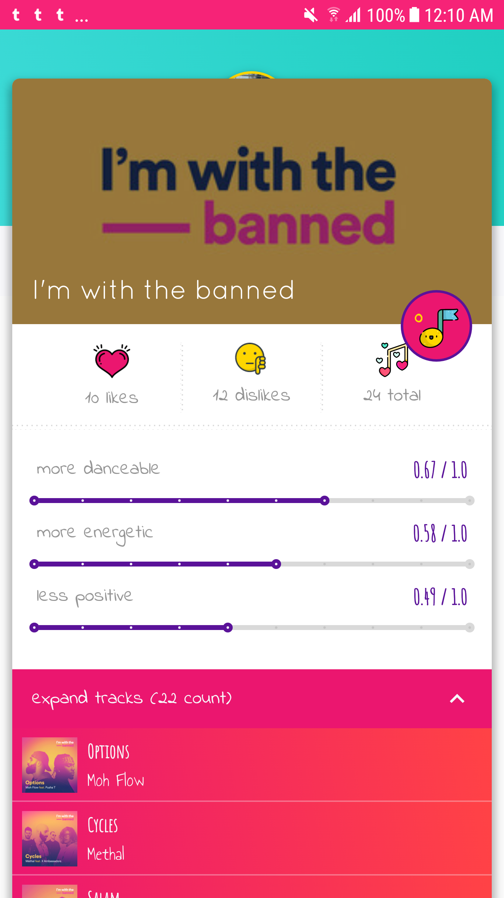

### SONGBITS





A playlist assistant for Spotify - swipe playlists to like and dislike tracks, create playlists from your likes, view tracks 
stats, 
and build your own recommendations by hand-tuning stats and genres! 

One day I got frustrated with Discover Weekly and thought "why can't 
I just pluck out the one or two tracks I actually like??" and hence "tinder for spotify" was born. And then I added more screens so I 
wouldn't have to call it "tinder for spotify". :thumpsup:
 
 

#### SUMMARY 

This project was really an excuse for me to explore some nifty Android developments while learning kotlin, so it 
involves:
- Model-View-Intent "reactive" architecture, inspired by React Redux's uni-directional data flow
- android arch components and Room
- lots of UI tidbits like shared element transitions and lottie
- 100% KOTLIN

MVI: https://github.com/oldergod/android-architecture/tree/todo-mvi-rxjava


#### Building the App 

Create a `secrets.properties` file in project root. Add two keys:
```
SPOTIFY_CLIENT_ID = 12345 
SPOTIFY_REDIRECT_URI = songbits://callback
```

If you have trouble with gradle, try:
 - check `ic_launcher_foreground.xml` isn't malformed, sometimes import cuts off the vector
 - delete the project `.gradle` and `buildSrc/build` folders
 
 
##### TODOs

Upcoming features:
- Spotify SDK integration to play tracks without preview urls
- "Add to existing playlist" functionality
- Pagination with DiffUtil + Paging library

#### READING

